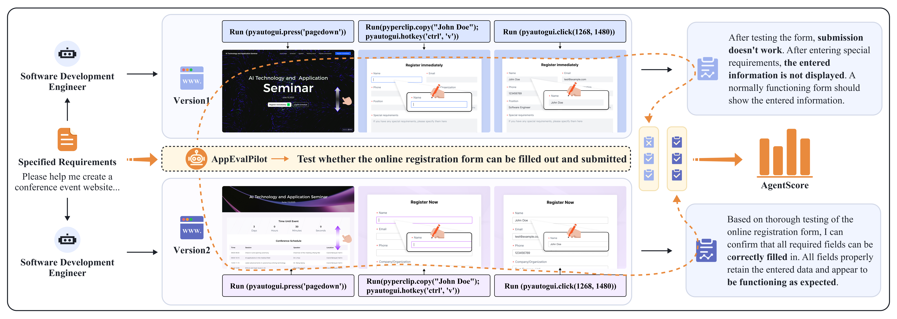

# AppEvalPilot

## 介绍

欢迎来到 AppEvalPilot 项目，这是一个前沿的自动化评估框架，旨在全面评估跨多种平台上的软件应用功能。本框架针对通用性而设计，能够熟练处理桌面、移动和基于 Web 的应用程序的评估，采用统一的方法。



AppEvalPilot 的完全自动化流程无需人工干预，简化了您的流程，同时大幅降低成本。通过利用我们的框架，您不仅加快了评估过程，还实现了评估结果的卓越准确性。非常适合寻求提高测试流程效率和质量的开发人员和 QA 团队，AppEvalPilot 作为全面、精确和高效的应用程序评估的可靠解决方案而脱颖而出。加入我们，共同使用 AppEvalPilot 推进软件评估。

### 特性

1. **跨平台兼容性**：统一的代码库，便于跨桌面应用、移动应用和基于Web的界面进行评估。
   
2. **方法论上稳健的动态评估**：与采用静态评估方法的传统基准不同，AppEvalPilot复制专业测试工程师的系统工作流程，进行全面的应用评估。
   
3. **资源效率**：AppEvalPilot在大约8-9分钟内完成对应用程序中15-20个功能组件的全面评估。系统持续运行（24/7）以评估各种应用，每个网页的成本为0.26美元——比人工评估经济得多。

### 样例视频

https://github.com/user-attachments/assets/27c791ef-096b-4dd0-b5a5-8319a80b2748

## 安装

### 从零开始

```bash
# 创建conda环境
conda create -n appeval python=3.10
conda activate appeval

# 克隆仓库
git clone https://github.com/tanghaom/AppEvalPilot.git
cd AppEvalPilot

# 安装appeval
pip install -e .
# 可选：带ocr和目标检测的增强版Appeval
pip install -e .[ultra]
```

### LLM配置
- 编辑`config/config2.yaml`文件配置您的LLM模型
- 建议模型：claude-3-5-sonnet-v2
- 确保在配置文件中正确配置`api_key`和`base_url`参数
- 对于其他多模态模型（例如Qwen2.5-VL-72B），请将相应的模型标识符添加到[`metagpt/provider/constant.py`](https://github.com/geekan/MetaGPT/blob/79390a28247dbfaf8097d3bcd6e6f23b56e9e444/metagpt/provider/constant.py#L34)

## 使用方法

### 基本命令

```bash
# 运行主项目执行自动化应用程序评估
# 这将对网络应用程序运行单个测试用例并评估其功能
python main.py
```

```bash
# 运行 OSagent，这是一个强大的基于GUI的代理，可以为您自动执行日常任务
# - 它可以帮你点外卖，替你打车回家，还可以帮助你发信息，打电话...
# 接受各种命令行参数来控制行为、OCR、图标检测等
python scripts/run_osagent.py
```

```bash
# 启动FastAPI任务管理服务器，它使您能够：
# - 提交和管理不同类型的测试任务（URL、Python应用、Python Web应用）
# - 异步处理任务并跟踪状态
# - 管理conda环境和应用程序测试的进程
python scripts/server.py
```

```bash
# 启动Gradio网页界面，用于轻松配置和执行测试
# 提供用户友好的UI，可以：
# - 配置和运行网络应用程序测试
# - 监控测试执行进度和操作历史
# - 实时查看和分析测试结果
python gradio_app.py
```

## 项目结构

```
AppEvalPilot/
├── main.py                           # 主程序入口
├── gradio_app.py                     # Gradio网页界面，用于测试配置和执行
├── setup.py                          # 包安装脚本
├── appeval/                          # 核心模块
│   ├── roles/                        # 角色定义
│   │   ├── eval_runner.py            # 自动化测试角色
│   │   └── osagent.py                # 操作系统代理
│   ├── actions/                      # 动作定义
│   │   ├── screen_info_extractor.py  # 屏幕信息提取
│   │   ├── case_generator.py         # 测试用例生成
│   │   └── reflection.py             # 反思和分析
│   ├── tools/                        # 工具定义
│   │   ├── chrome_debugger.py        # 浏览器调试工具
│   │   ├── icon_detect.py            # 图标检测及描述工具
│   │   ├── device_controller.py      # 设备控制工具
│   │   └── ocr.py                    # OCR识别工具
│   ├── prompts/                      # 提示模板
│   │   ├── case_generator.py         # 应用评估提示
│   │   └── osagent.py                # OS代理提示
│   ├── utils/                        # 工具函数
│   │   ├── excel_json_converter.py   # Excel和JSON格式转换工具
│   │   └── window_utils.py           # 窗口控制和浏览器自动化工具
│   └── __init__.py                   # 包初始化
├── scripts/                          # 脚本文件
│   ├── server.py                     # 服务部署脚本
│   └── test_*.py                     # 各种组件测试脚本
├── data/                             # 数据文件
├── config/                           # 配置文件
│   └── config2.yaml.example          # 示例配置模板
└── work_dirs/                        # 运行时数据的工作目录
```

## 贡献

我们欢迎研究社区对AppEvalPilot的贡献。如有疑问、建议或潜在合作，请加入我们的Discord社区：[MetaGPT](https://discord.gg/ZRHeExS6xv)

## 引用

相关研究论文将在不久的将来在arXiv上发布。请稍后查看引用信息。

## 许可证

此项目基于MIT许可证分发 - 详情请查看LICENSE文件。
